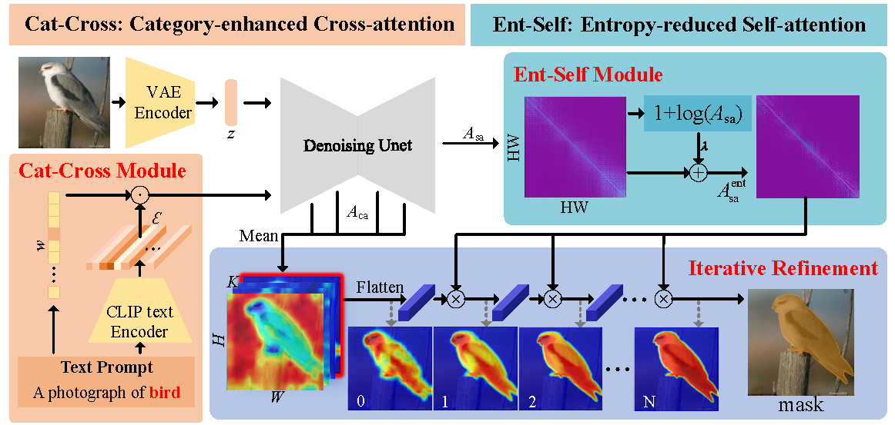
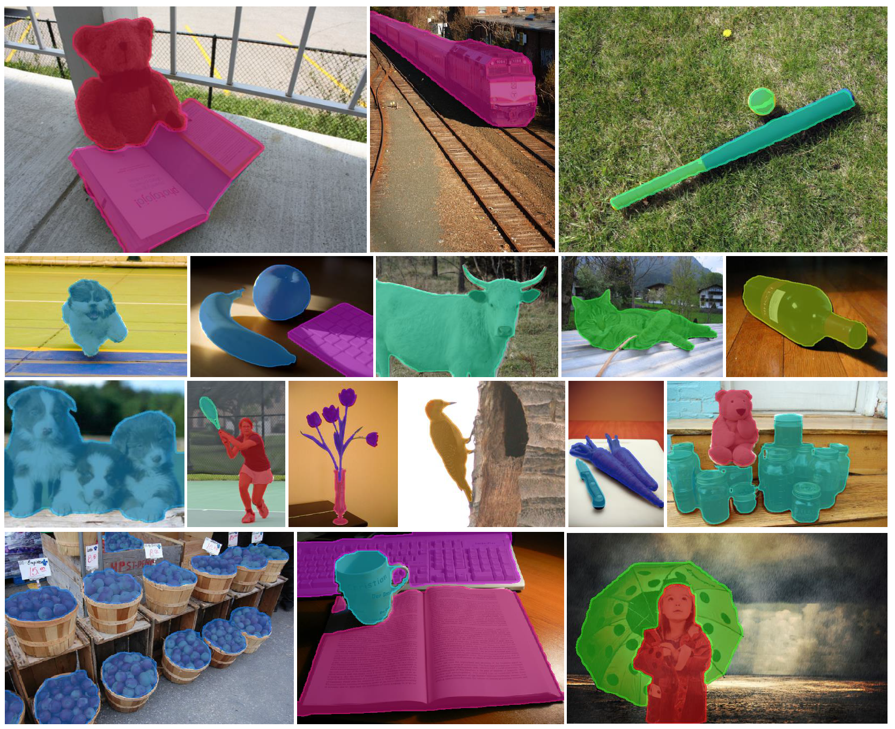
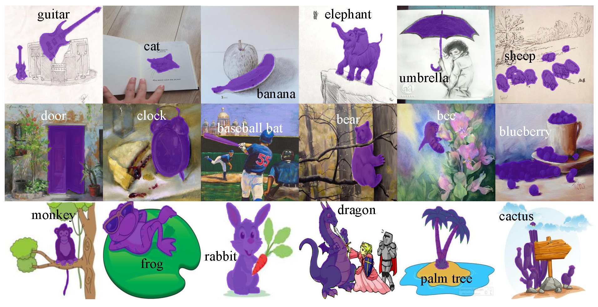

# iSeg: An Iterative Refinement-based Framework for Training-free Segmentation

This repo is the official implementation of `iSeg: An Iterative Refinement-based Framework for Training-free Segmentation`

<div style="display: flex;">
    
</div>
<div style="display: flex;">
    
</div>
<div style="display: flex; margin-top: 5px">
    
</div>
<div style="display: flex;">
    
</div>


## Introduction

<div style="display: flex; flex-direction: column; align-items: center; justify-content: center; text-align: center;">
    <p>Framework</p>
    
</div>

- We present a simple iterative training-free segmentation framework using stable diffusion, named
  iSeg. Based on the self attention maps in stable diffusion model, iSeg provides a more and more
  accurate semantic segmentation result with the increasing iterations.
- We introduce an entropy-reduced self-attention module to remove the diffusion of the irrelevant global
  information in original self attention maps.
- We further introduce a category-enhanced cross-attention module for the more accurate initial cross attention.
- iSeg is powerful enough for zero-shot and open-vocabulary segmentation tasks, which can be used for not only natural 
  and synthetic images, but also clipart, painting, sketch images and so on.
- We further provide interaction demo which is able to segment objects by points, lines, boxes and descriptions.

For further details, please check out our [paper](https://arxiv.org/pdf/2409.03209).
## Installation
following the codeblock below to install the dependencies.

```
# create conda environment
conda env create -f environment.yaml
conda activate iSeg
```

We use stable diffusion model 2.1-base as our base model, which is available in [here](https://huggingface.co/stabilityai/stable-diffusion-2-1-base).

Our code will automatically download the model. If you failed to download the model because of proxy,
you can try to add the following code at the beginning of **interactive_iSeg.py**.

```
import os
os.environ['HF_ENDPOINT'] = 'https://hf-mirror.com'
```
## Usage

**this work is time-efficient and memory-efficient and without training, which means you can run it on a single GPU with 5GB memory and directly run it as follows**

### Data Preparation
Please struct the datasets as follows
```none
datasets
├── coco2014
│   ├── train2014
│   │   ├── COCO_train2014_000000000009.jpg
│   ├── val2014
│   │   ├── COCO_val2014_000000000042.jpg
│   ├── coco_seg_anno
│   │   ├── 000000000009.png
├── VOCdevkit
│   ├── VOC2010
│   │   ├── JPEGImages
│   │   │   ├── 2007_000027.jpg
│   │   ├── SegmentationClassContext
│   │   │   ├──2008_000002.png
│   ├── VOC2012
│   │   ├── JPEGImages
│   │   │   ├── 2007_000027.jpg
│   │   ├── SegmentationClassAug
│   │   │   ├──2007_000032.png
```

### Interactive Demo
We provide an interactive demo for you to try our model. The demo can provide segmentation results by points, 
lines, boxes and descriptions. To run it, please follow the steps below:
```
cd ui
sh run.sh
```
<div style="display: flex;">
    
</div>

### Weakly Supervised Semantic Segmentation 

To implement the weakly supervised semantic segmentation task, you should follow the steps below:

- evaluate the voc dataset, please cd to the wsss folder and open the arguments.py, 
where you should activate ```parser = add_voc_dataset_args(parser)``` while deactivating 
```parser = add_coco_object_dataset_args(parser)``` in lines 105 and 106;
- evaluate the coco dataset, please cd to the wsss folder and open the arguments.py, 
where you should activate ```parser = add_coco_object_dataset_args(parser)``` while deactivating 
```parser = add_voc_dataset_args(parser)``` in lines 105 and 106
- run the code ``` sh shell_main.sh ```

### Open-Vocabulary Semantic Segmentation

- evaluate the voc dataset, please cd to the ovs folder and open the arguments.py, 
where you should activate ```parser = add_voc_dataset_args(parser)``` while deactivating 
```parser = add_voc_context_dataset_args(parser)``` and 
```parser = add_coco_object_dataset_args(parser)``` in lines 130 to 132;
- evaluate the coco object dataset, please cd to the wsss folder and open the arguments.py, 
where you should activate ```parser = add_coco_object_dataset_args(parser)``` while deactivating 
```parser = add_voc_dataset_args(parser)``` and 
```parser = add_voc_context_dataset_args(parser)``` in lines 130 to 132;
- evaluate the context dataset, please cd to the wsss folder and open the arguments.py, 
where you should activate ```parser = add_voc_context_dataset_args(parser)``` while deactivating 
```parser = add_voc_dataset_args(parser)``` and 
```parser = add_coco_object_dataset_args(parser)``` in lines 130 to 132;
- run the code ``` sh shell_ovs.sh ```

## Results

<div style="display: flex; flex-direction: column; align-items: center; justify-content: center; text-align: center;">
    <p>Natural Image</p>
    
    <p>Cross Domain Image</p>
    
</div>

with the default configs, you will get the following results (or similar because of the noise adding into the image):

- for weakly supervised semantic segmentation task:

| VOC  | COCO |
|:----:|:----:|
| 75.5 | 45.5 |

- for open-vocabulary semantic segmentation task:

| VOC  | Context | Context |
|:----:|:-------:|:-------:|
| 68.6 |  30.9   |  38.4   |

## Citation
```
@article{Sun_2024_iSeg,
    author    = {Lin Sun and Jiale Cao and Jin Xie and Fahad Shahbaz Khan and Yanwei Pang   },
    title     = {iSeg: An Iterative Refinement-based Framework for Training-free Segmentation},
    journal   = {arXiv preprint arXiv:2409.03209},
    year      = {2024},
}
```

## Acknowledgement
We would like to acknowledge the contributions of public projects, such as [SLiMe](https://github.com/aliasgharkhani/SLiMe), [TagCLIP](https://github.com/linyq2117/TagCLIP) whose code has been utilized in this repository.
