# iSeg: An Iterative Refinement-based Framework for Training-free Segmentation

This repo is the official implementation of `iSeg: An Iterative Refinement-based Framework for Training-free Segmentation`

<div style="display: flex;">
    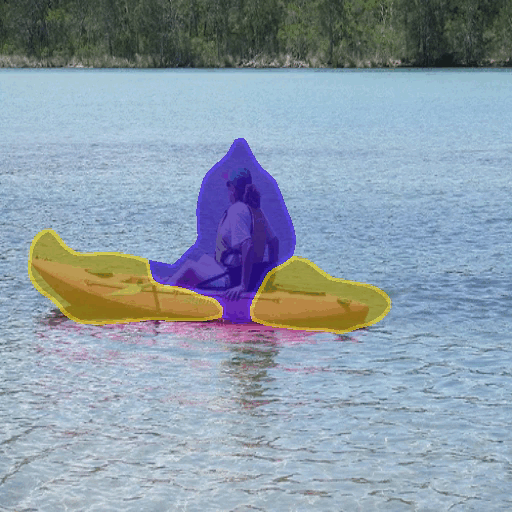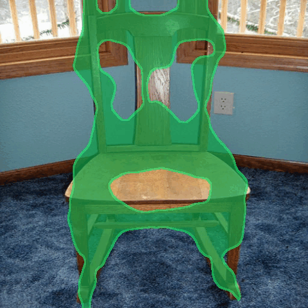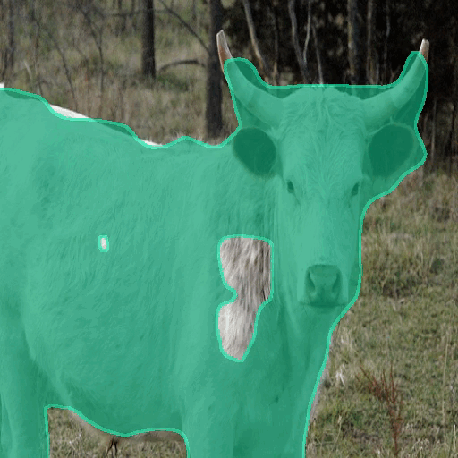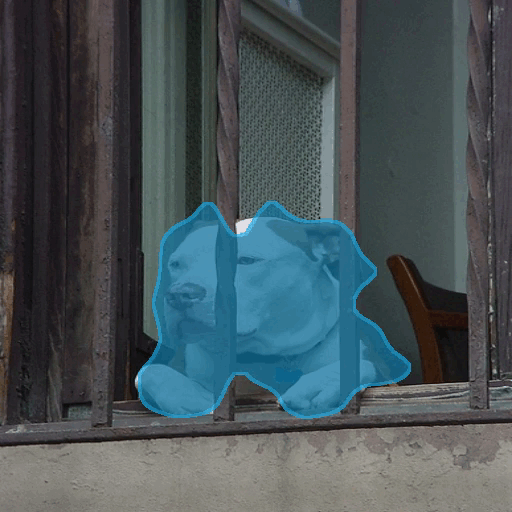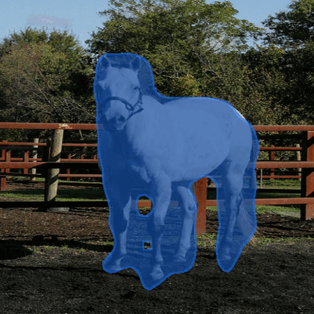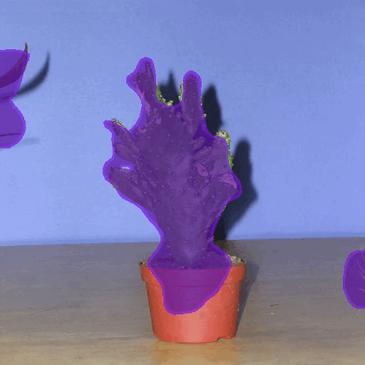
</div>
<div style="display: flex;">
    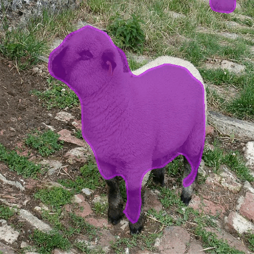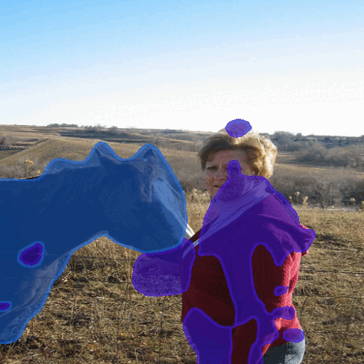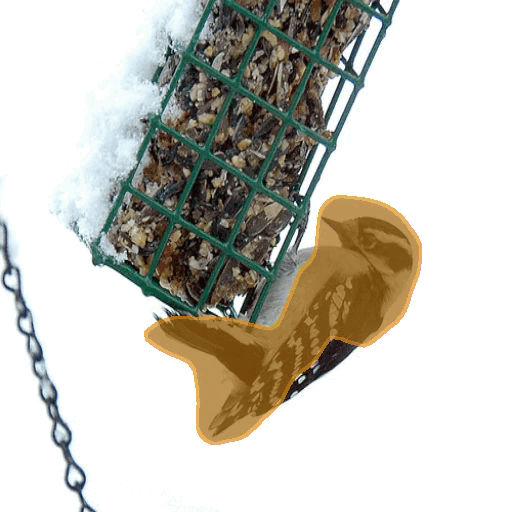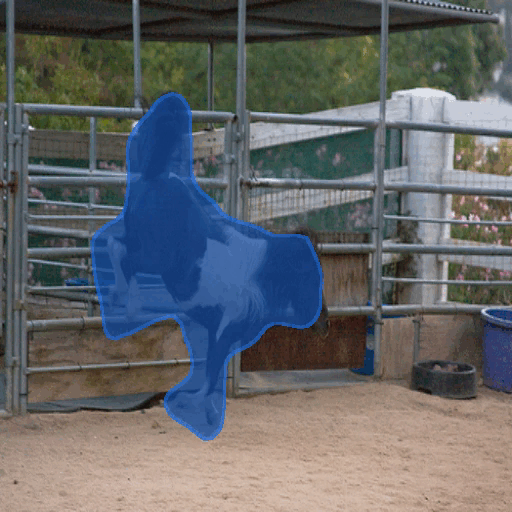
</div>
<div style="display: flex; margin-top: 5px">
    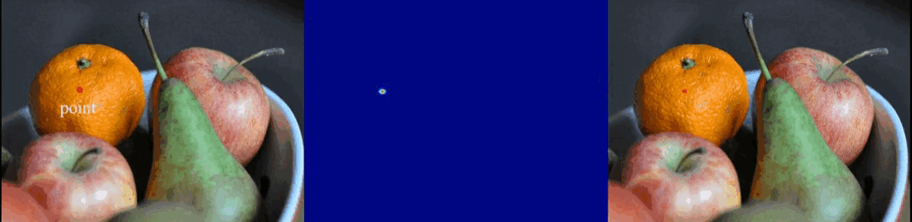
</div>
<div style="display: flex;">
    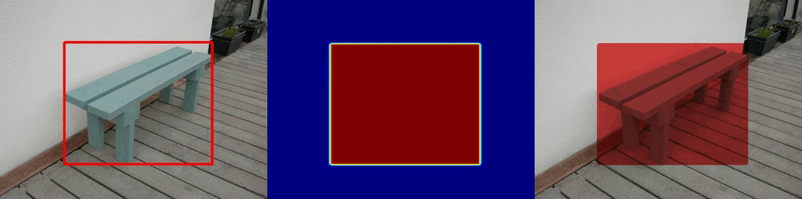
</div>


## Introduction
- We present a simple iterative training-free segmentation framework using stable diffusion, named
  iSeg. Based on the self attention maps in stable diffusion model, iSeg provides a more and more
  accurate semantic segmentation result with the increasing iterations.
- We introduce an entropy-reduced self-attention module to remove the diffusion of the irrelevant global
  information in original self attention maps.
- We further introduce a category-enhanced cross-attention module for the more accurate initial cross attention.
- iSeg is powerful enough for zero-shot and open-vocabulary segmentation tasks, which can be used for not only natural 
  and synthetic images, but also clipart, painting, sketch images and so on.
- We further provide interaction demo which is able to segment objects by points, lines, boxes and descriptions.

For further details, please check out our [paper](http://arxiv.org/abs/2403.12455).
## Installation
following the codeblock below to install the dependencies.

```
# create conda environment
conda env create -f environment.yaml
conda activate iSeg
```

We use stable diffusion model 2.1-base as our base model, which is available in [here](https://huggingface.co/stabilityai/stable-diffusion-2-1-base).

Our code will automatically download the model. If you failed to download the model because of proxy,
you can try to add the following code at the beginning of **interactive_iSeg.py**.

```
import os
os.environ['HF_ENDPOINT'] = 'https://hf-mirror.com'
```
## Usage
### Interactive Demo
```
cd ui
sh run.sh
```
<div style="display: flex;">
    
</div>

### Weakly Supervised Semantic Segmentation 
TODO

### Open-Vocabulary Semantic Segmentation
TODO

## Results
TODO

## Citation
TODO

## Acknowledgement
We would like to acknowledge the contributions of public projects, such as [SLiMe](https://github.com/aliasgharkhani/SLiMe), [TagCLIP](https://github.com/linyq2117/TagCLIP) whose code has been utilized in this repository.
